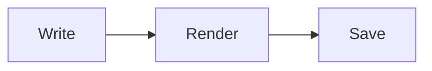

# Markdown Guide

This document is itself rendered by Marku, so each example shows the real
result.

## Headings

# Heading 1
## Heading 2
### Heading 3

## Emphasis

**bold**, _italic_, ~~strikethrough~~, `inline code`.

## Lists

- bullet item
- another item
  - nested item

1. first
2. second

## Task list

- [x] done
- [ ] not done

## Links and images

[A link](https://example.com)

## Blockquote

> A quoted line.

## Alerts (GitHub style)

> [!NOTE]
> Useful information.

> [!WARNING]
> Be careful.

## Table

| Feature | Supported |
| --- | --- |
| Tables | yes |
| Code | yes |

## Code block

```js
function hello(name) {
  return `Hi, ${name}`;
}
```

## Math (KaTeX)

Inline: $E = mc^2$

Display:

$$
\int_0^1 x^2 \, dx = \tfrac{1}{3}
$$

## Diagram (Mermaid)



## Raw HTML

Marku renders inline HTML such as <kbd>Cmd</kbd>. Unsafe tags (like `<script>`
or `<style>`) are escaped and shown as text by default; this is controlled by
**Escape unsafe HTML tags** in Settings -> Security.
